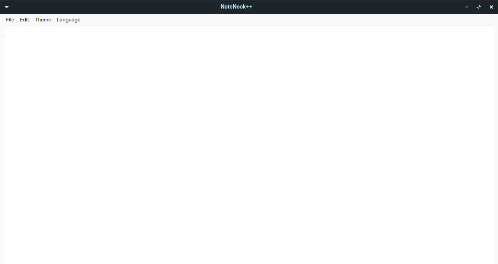
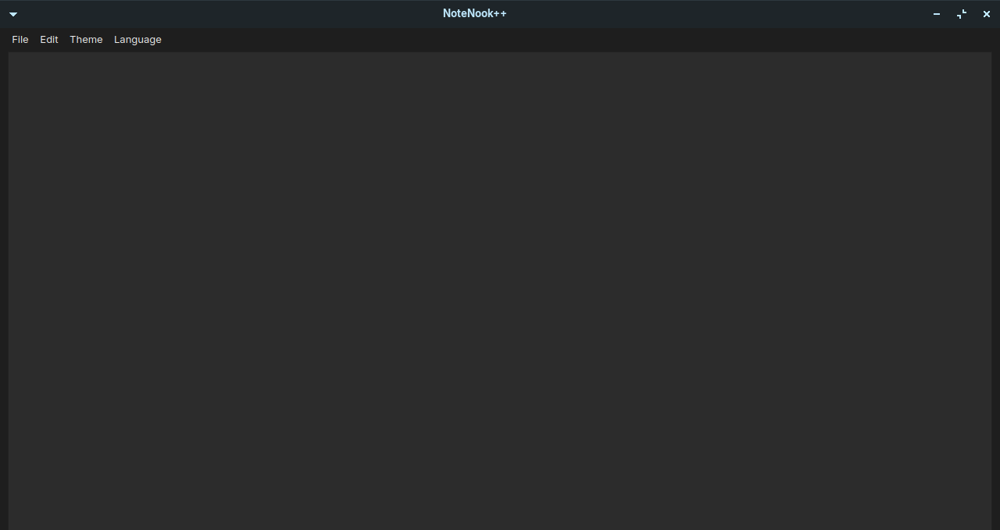
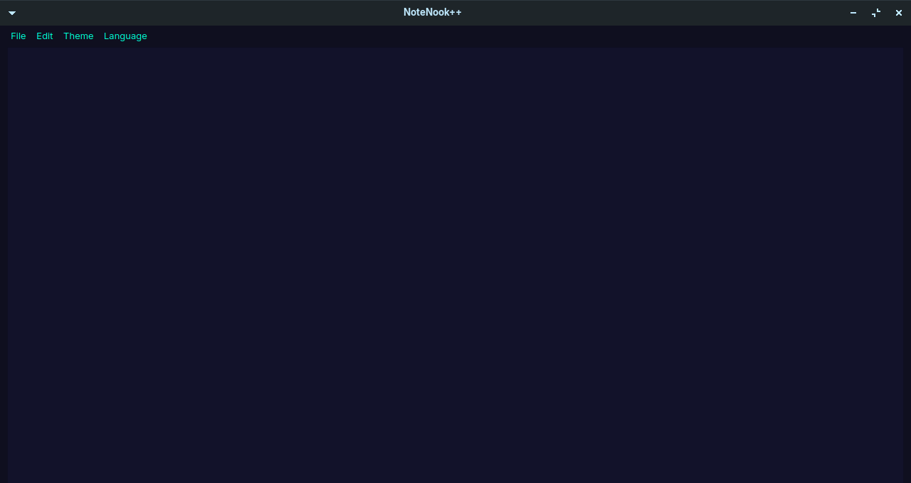

# NoteNook++ 📝

> Python ve PySide6 ile oluşturulmuş, modern, çapraz platform zengin metin düzenleyici.  
> Basit arayüz, güçlü biçimlendirme, tamamen açık kaynak.


---

## ✨ Özellikler

- 🎨 **8 yerleşik tema** — Beyaz, Karanlık, Siyah, Yeşil, Mavi, Mor, Pembe, Cyber
- ✍️ **Zengin metin biçimlendirmesi** — Kalın, İtalik, AltıÇilik klavye kısayollarıyla
- 🌍 **Çok dilli arayüz desteği**
- 📁 **Dosya yönetimi** — Yeni, Aç, Kaydet, Farklı Kaydet
- 🔍 **Yakınlaştır/uzaklaştırma** — Fare kaydırma veya klavye kısayolları
- 🖥️ **Çapraz platform** — Windows & Linux desteği

---

## 📸 Ekran Görüntüleri

| Beyaz Tema | Siyah Tema | Cyber Tema |
|---|---|---|
|  |  |  |

---

## 🚀 Kurulum
```bash
# Clone the repo
git clone https://github.com/Lynx491/NoteNook.git
cd NoteNook

# Install dependencies
pip install PySide6,screeninfo

# Run
python main.py
```

---

## ⌨️ Klavye Kısayolları

| Kısayollar | Açıklama |
|---|---|
| `Ctrl + B` | Kalın |
| `Ctrl + I` | İtalik |
| `Ctrl + U` | AltıÇizilik |
| `Ctrl + S` | Kaydet |
| `Ctrl + Shift + S` | Farklı Kayder |
| `Ctrl + O` | Dosya Aç |
| `Ctrl + N` | Yeni Dosya |
| `Ctrl + Scroll` | Yakınlaştır | Uzaklaştır |

---

## 🛠️ Kurulum

- [PySide6](https://doc.qt.io/qtforpython/) — GUI framework
- Python 3.10+

---

## 📄 Lisans

Apache 2.0 — see [LICENSE](LICENSE) for details.
