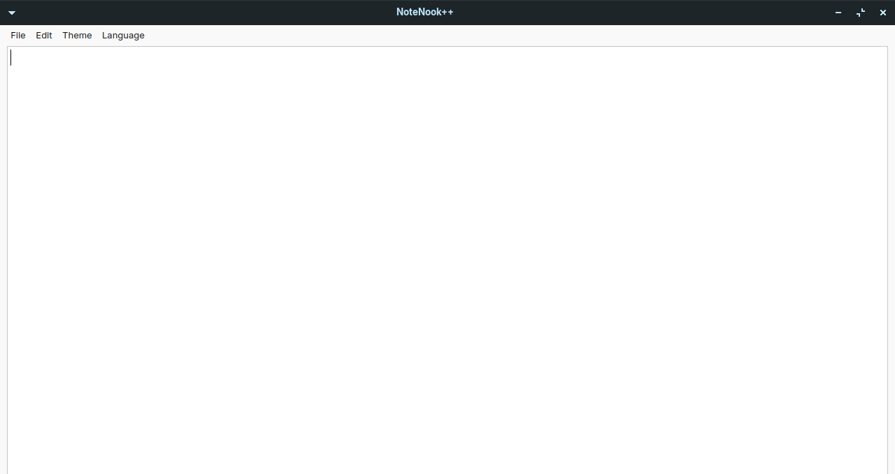
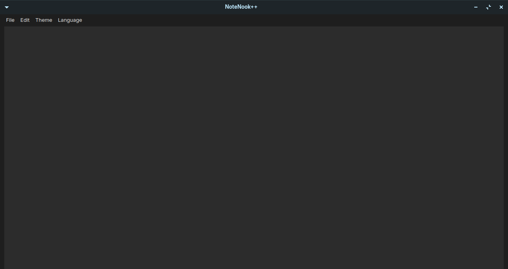
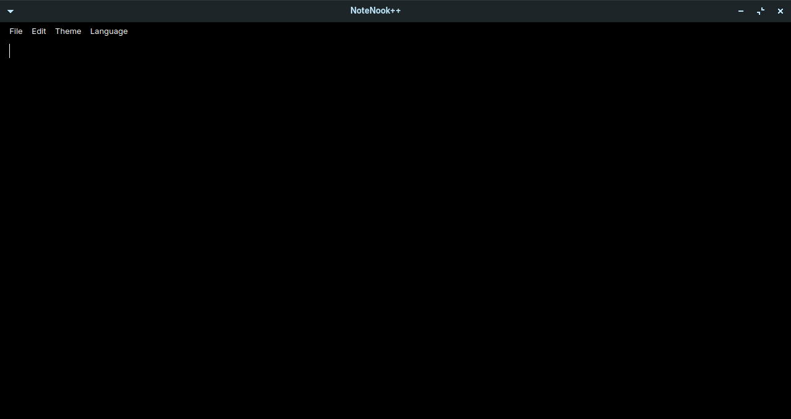
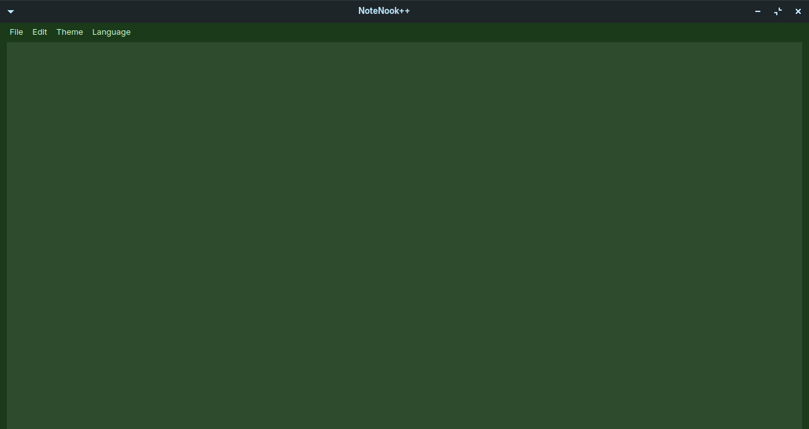
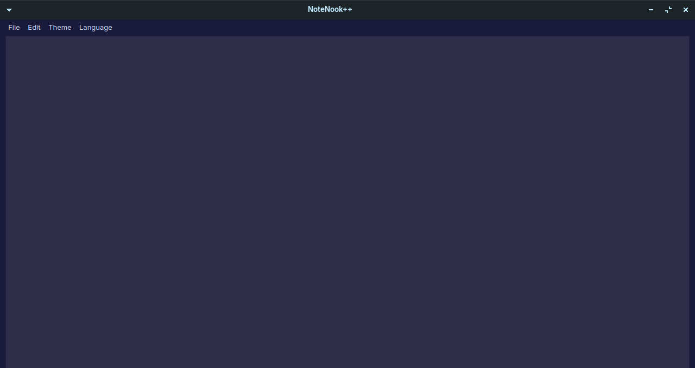
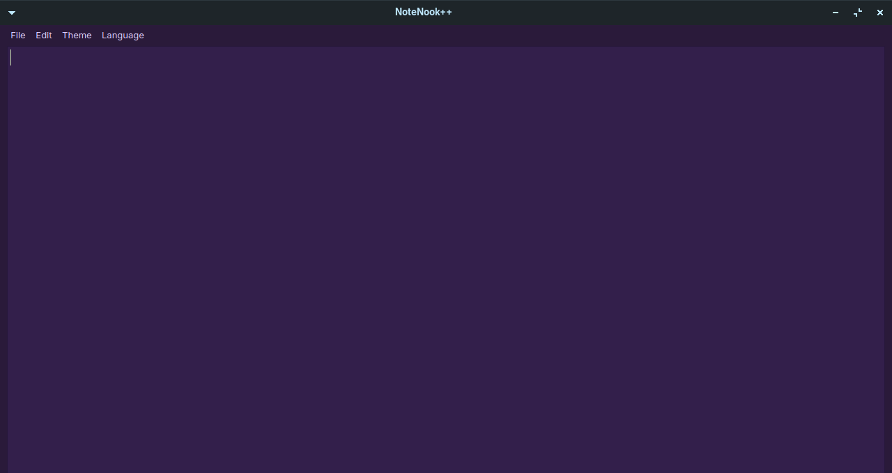
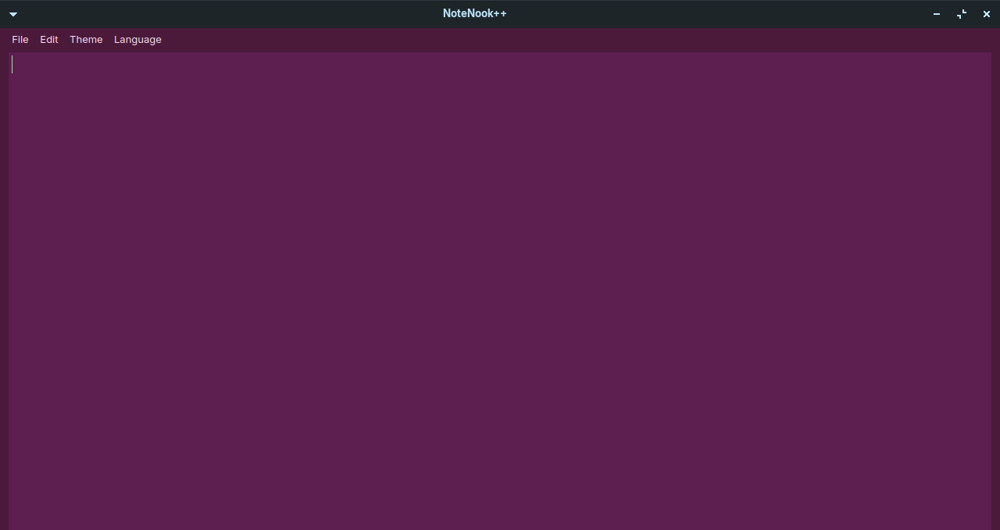
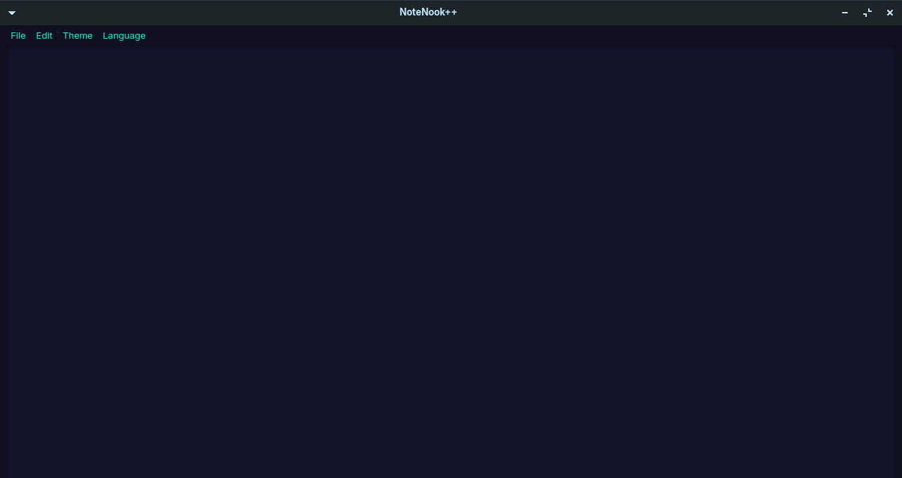

#           NoteNook++

## Advanced text editor, simple, stylish and modern

### screenshot

### key binds

Ctrl + I -> makes the line italicized 

Ctrl + B -> makes the line bold 

Ctrl + U -> underlines the line

Ctrl + M -> enlarges the line

Ctrl + L -> reduces the line

Ctrl + N -> creates a new file, if the existing file is saved it will be moved to the trash. (new file)

Ctrl + O -> opens a new file and loads the selected file, does not check if it has been saved before. (open file)

Ctrl + S -> saves the file if the file has been opened or saved differently, otherwise it does nothing. (save)

Ctrl + Shift + S -> saves the file to a different location. (save as)

Ctrl + Shift + M -> zoom in

Ctrl + Shift + L -> zoom out

Ctrl + Shift + I -> makes all text italic

Ctrl + Shift + B -> makes all text bold

Ctrl + Shift + U -> underlines the entire text

Ctrl + Mouse Scroll key, zoom in/zoom out

Mouse Scroll key, up/dawn navigation
